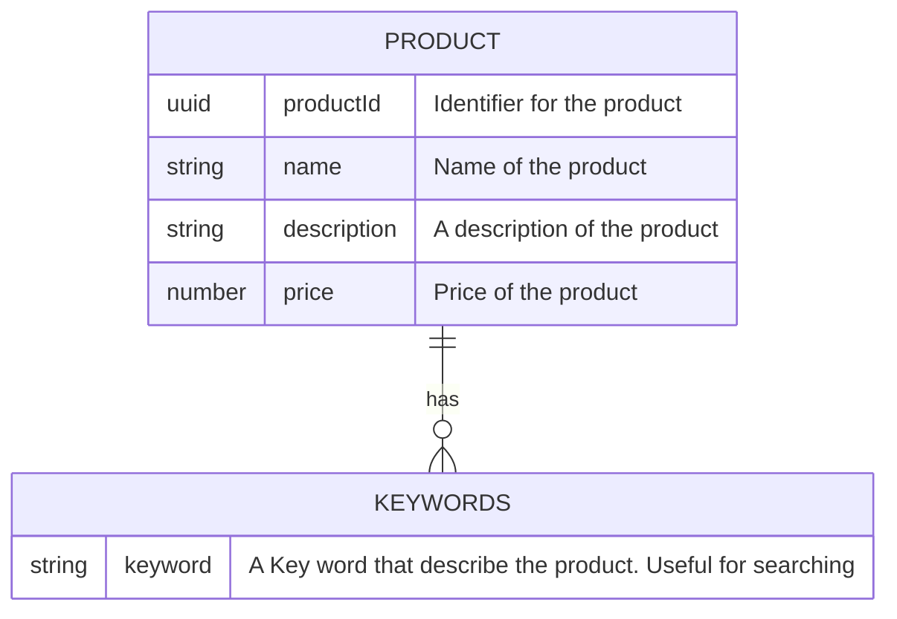
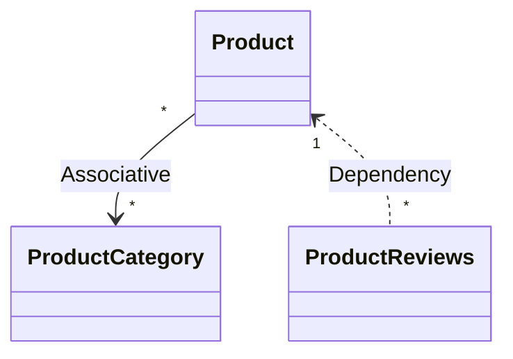

# API product name
Catalog API

# Job definition 
I want to care for my pet

# Job Stories
(The job story describes the core problem solving benefit of the API.)

When I need a product to care for my pet, I want to discover a great range of products in that category with quality reviews, so I can chose which I like.


When I find a pet product I want, I want to quickly and easily order it, so I can get it delivered to me the next day.


# API Consumer
The end user is a customer browsing Acme Pet Supplies products in order to make a purchase. They may do this via 3 main channels: 
1. the Acme mobile app (Acme channel)
2. the Acme web store (Acme channel)
3. an affiliate's store. 

# Digital capabilities 
- Browse for pet products
- Search for pet products

# old 
-  Search for a product by type and category
- View a product's details and its review ratings
- Find highest rated products in a category
- Place an order for next day delivery
- Get all product categories   
- Get all products
- Get all reviews for a product


# API Technology solution
REST API

# Access Level
Public API, made available for use by both Acme owned digital channels and to registered affiliates. 

# Usage plans
- **Acme mobile app:** 5 requests a minute
- **Acme  web store :** 5 requests a minute
- **Affiliate stores:** 4 requests a minute


# Security model
Secure the API with an API key to identify the application channel the traffic is coming from. API keys will be generated and managed via the dev portal. 

# API product manager
John Smith

# API operation profile
|Digital Capability| Operation Name| Operation Description |Participant| Web Resource | Request | Response | HTTP Method| Resource Path|  
|-----------|-----------|-----------|-----------|-----------|-----------|-----------|-----------|-----------|
|Browse for products| listProductsInACategory |List all products in a category, providing ordering and pagination parameters  | Customer | ProductCategory| Product Category ID, sort by field, order direction, page size, page token (cursor) | Product[], pagination info | GET | /product-categories/{productCategoryId}/products?sortBy={sortingAttribute}&orderBy={orderingDirection}&pageToken={pageToken}&maxPageSize={maxPageSize} |
|Browse for products| listProductCategories |List all product categories, providing number of products in a category. A small collection so pagination not required.  | Customer | ProductCategory|   | ProductCategory[] | GET | /product-categories |
|Browse for products| viewProduct |View a product's details | Customer | Product | Product ID   | Product | GET | /product/{productId} |
|Browse for products| getProductReviews |Get all reviews for a product | Customer | Reviews |   | ProductReviews[] | GET | /product-reviews/{productReviewId} |


# API Model



```mermaid
erDiagram
    PRODUCT ||--o{ KEYWORDS 
    PRODUCT { 
      string productId 
      string name 
      string description
      string price
    }    
```
string[] keywords "Key words that describe the product. Useful for searching"
|productCategories|name and link to the productCategories this product belongs to|

## Product
|Item|Description|
|----|-----------|
|productId|Identifier for the product|
|name|Name of the product|
|description|A description of the product|
|price|Price of the product|
|keywords|Key words that describe the product. Useful for searching|
|productCategories|name and link to the productCategories this product belongs to|

## ProductCategory
|Item|Description|
|----|-----------|
|categoryId|ID of the product category|
|categoryName|Name of the product category|
|products|The name, price and link to products in this category|
|numberOfProducts|Number of products in the category|

## ProductReviews
|Item|Description|
|----|-----------|
|productId||
|reviews||
|rating||
|date||
|author||

# Resource relationships



# Data model

## Category
|Item|Description|
|----|-----------|
|categoryId||
|categoryName||

## Reviews
|Item|Description|
|----|-----------|
|reviewID|
|title||
|content||
|rating||
|date||
|author||


# later
|Browse for products|List all product categories|||||||

|Browse for products|List all products in a category| List by price ascending| Customer | List all products in a category sorted by their selling price, lowest first |listProductsByPriceAsc| Category| Category ID, sort by product, order ascending | Product[], pagination info | GET | /categories/{categoryId}/products?sort_by=product&order_by=asc|

|Browse for products|List all products in a category| List by review rating descending|Customer |List all products sorted by review rating, highest first| listProductsByReviewDesc|Category| Category, sort by review, order descending| Product[] |

|Browse for products|View a product's details|||||||
|Browse for products|Get all reviews for a product|||||||
|Browse for products|Find highest rated products in a category|||||||


