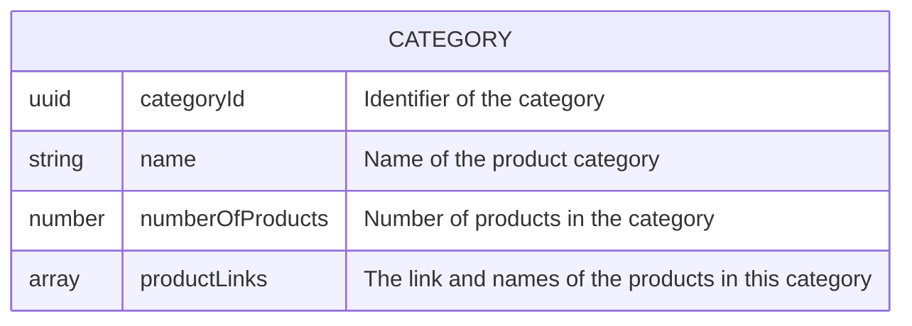
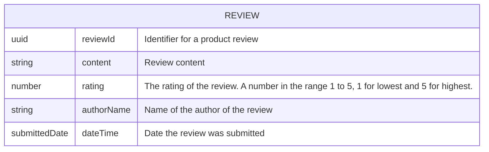
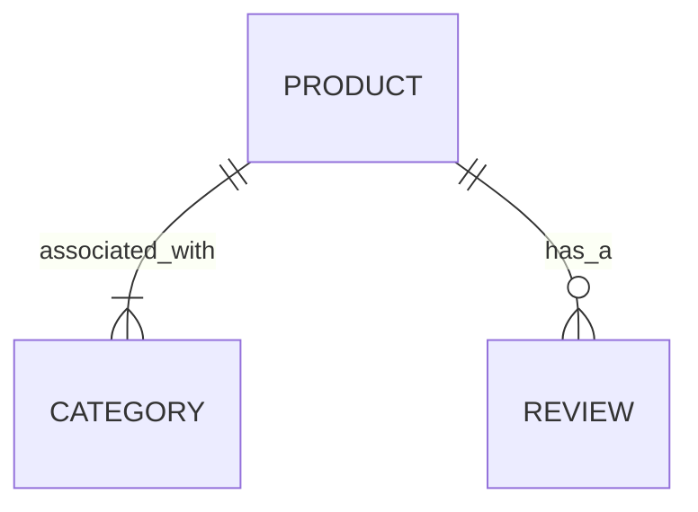
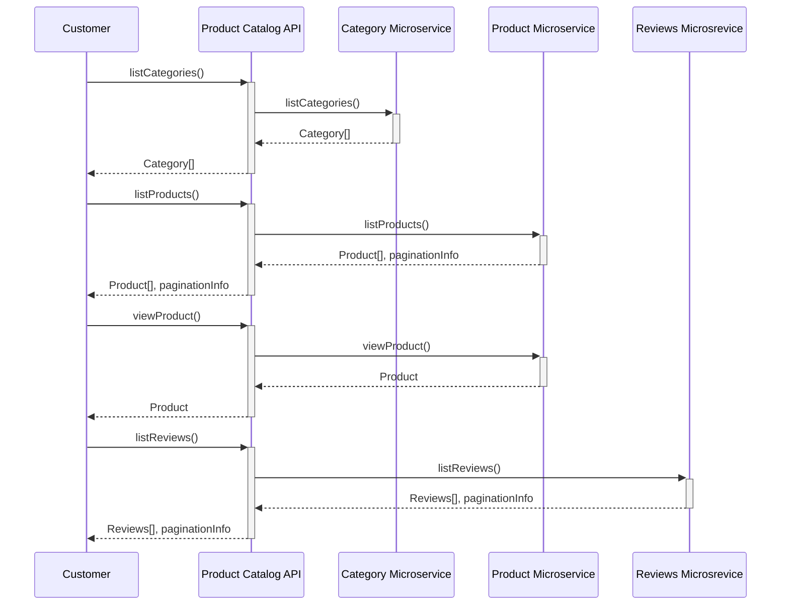

# API product name
Product Catalog API

# API Consumer
The end user is a customer browsing Acme Pet Supplies products in order to make a purchase. They may do this via 3 main channels: 
1. The Acme mobile app (Acme channel)
2. The Acme web store (Acme channel)
3. An affiliate's store. 

# Job Stories (core problem solving benefit)

When I need a product to care for my pet, I want to discover a great range of products in that category with quality reviews, so I can chose which I like.

# User tasks
- Browse for pet products in the Acme catalog. (MVP)
- Search for pet products in the Acme catalog. (Phase 2)

# API Technology Solution and Versioning Strategy
This is a REST API. It will use path level versioning 

# Access Level
Public API, made available for use by both Acme owned digital channels and to registered affiliates. 

# Usage plans
- **Acme mobile app:** 5 requests a minute
- **Acme  web store :** 5 requests a minute
- **Affiliate stores:** 4 requests a minute

# Security model
Secure the API with an API key to identify the application channel the traffic is coming from. API keys will be generated and managed via the dev portal. 

# API product manager
John Smith

# API operation profile
|User Tasks| Operation Name| Operation Description |Participant| Web Resource | Request | Response | HTTP Method| Resource Path| Response Code|   
|-----------|-----------|-----------|-----------|-----------|-----------|-----------|-----------|-----------|-----------|
|Browse for products| listCategories |List all categories. | Customer | Category | Filter by field, sort by field, order direction, page size, page cursor  | Category[], PaginationInfo | GET | /categories | 200 |
|Browse for products| listProducts |List all products. | Customer | Product| Filter by field, sort by field, order direction, page size, page cursor | Product[], PaginationInfo | GET | /products |  200 |
|Browse for products| viewProduct |View a product's details. | Customer | Product | Product ID   | Product | GET | /products/{productId} | 200 |
|Browse for products| listReviews |Get all reviews. | Customer | Review |  Filter by field, sort by field, order direction, page size, page cursor | Reviews[], PaginationInfo | GET | /reviews |  200 |

# Web Resources

# Web Resource Relationships

# API Sequence diagram

